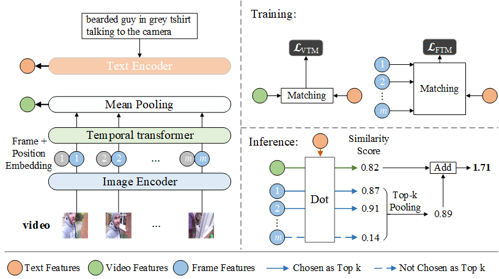

<div style="text-align:center"><h1>HMMC<br/></h1>
<h2>Paper: End-to-end Pre-training with Hierarchical Matching and Momentum Contrast for Text-Video Retrieval</h2>
</div>

<p style="text-align:center">
<a href="https://huggingface.co/spaces/cheetah003/HMMC_t2v_search" target="_blank">Try Demo here</a>
  
<a href="https://ieeexplore.ieee.org/document/10124819" target="_blank">Our Paper has been published on TIP 2023</a>
</p>

<p style="text-align:center">
  <a href="https://www.python.org/" target="_blank">
    
  </a>
  <a href="https://pytorch.org/" target="_blank">
    
  </a>
  <a href="https://github.com/cheetah003/HMMC/stargazers">
    
  </a>
  <a href="https://github.com/cheetah003/HMMC/network/members">
    
  </a>
  <a href="https://huggingface.co/spaces/cheetah003/HMMC_t2v_search" target="_blank">
    
  </a>
</p>

The implementation of paper "End-to-end Pre-training with Hierarchical Matching and Momentum Contrast for Text-Video Retrieval".

HMMC(Hierarchical Matching and Momentum Contrast) is a text-video retrieval model(support Chinese and English) based on [CLIP](https://github.com/openai/CLIP), which pre-trained on 400M image-text pairs in an end-to-end manner. We introduce HMMC model for video-language pre-training, taking advantage of both global video representation and frame features with a hierarchical matching mechanism. We also collected a large-scale Chinese video-language dataset (over 763k unique videos) named CHVTT to explore the multilevel semantic connections between videos and texts. Experimental results on two major Text-video retrieval benchmark datasets demonstrate the advantages of our methods.


## Model Architecture
### Overall Architecture: ###

### Hierarchical Matching: ###



## Requirement
```
pip install -r requirements.txt
```

## Data Preparing

### Public Datasets ###
* MSR-VTT [download link](http://ms-multimedia-challenge.com/2017/dataset)

* VATEX(Chinese and English version) [download link](https://eric-xw.github.io/vatex-website/download.html)

### Write video frames to lmdb ###
We found that pre-training on videos is a time-consuming task, especially when extracting raw frames from videos via OpenCV. To address this issue, we pre-extract raw frames for efficiency and save them to lmdb. Dateloaders will directly read video frames from lmdb, which can speed up training. (e.g. We fine-tuned the model for 5 epochs with a 256 batch size on 8 NVIDIA Tesla V100 GPUs and it takes about 1 hour on MSR-VTT).

Parameters such as video_dir and lmdb_path in tools/frame2lmdb.py can be changed and then run:
```
python tools/frame2lmdb.py
```


## How to Run
main_pretrain.py is for pre-training while main_task_retrieval.py is for fine-tuning and testing.

>`--do_pretrain`,`--do_train` and `--do_eval` means pre-training, fine-tuning and testing.
>
>`--output_dir` means the path where you want to save the results
>
>`--contrast_num_negative` means momentum queue size
>
>`--contrast_momentum` means momentum queue size
>
>`--top_frames` means k in top-k choose
>
>`--language` means which language for text(choose from [chinese, english])
>
>`--dataset` means which dataset to use(choose from [chvtt, msrvtt, vatex])


### Pre-train: ###
For example, run:
```
python -m torch.distributed.launch --nproc_per_node=8 --master_port 11000 \
main_pretrain.py --do_pretrain --num_thread_reader=8 \
--epochs=11 --batch_size=128 --n_display=596 \
--contrast_num_negative 1024 --contrast_momentum 0.99 \
--output_dir ckpts/pretrain/ablation7w_11epoch/FAM0.05_VTM0.45_FTM0.45_MLM0.05_m0.99_q1024_f30_e-7_e-4_11epoch_8GPU \
--top_frames 3 \
--max_frames 12 --frame_sample random  --use_temp --use_frame_fea \
--lr 1e-4 --text_lr 1e-4 --coef_lr 1e-3 --batch_size_val 128  \
--language chinese --dataset chvtt
```
to pre-train model on CHVTT in Chinese for 11 epochs with 8 GPUs.

### Fine-tuning: ###
>`--init_model` means the pre-trained model path
>
For example, run:
```
python -m torch.distributed.launch --nproc_per_node=8 --master_port 11000 \
main_task_retrieval.py --do_train --num_thread_reader=8 \
--epochs=5 --batch_size=256 --n_display=100 \
--output_dir ckpts/msrvtt/vit32_VTM0.85_FTM0.15_cross3_frame30_256_8GPU_pretrained \
--top_frames 2 \
--max_frames 12 --frame_sample random  --use_temp --use_frame_fea \
--lr 1e-4 --text_lr 1e-7 --coef_lr 1e-3 --batch_size_val 256  \
--task retrieval --dataset msrvtt --language english \
--init_model ckpts/pretrain/english/FAM0_VTM0.45_FTM0.45_MLM0_m0.99_q1024_f30_whole/pytorch_model.bin.2
```
to fine-tune the pre-trained model on MSR-VTT in English for 5 epochs with 8 GPUs.

### Testing: ###
For example, run:
```
CUDA_VISIBLE_DEVICES=0  \
python -m torch.distributed.launch --nproc_per_node=1 --master_port 12000 \
main_task_retrieval.py --do_eval --num_thread_reader=8 \
--epochs=1 --batch_size=64 --n_display=1 \
--output_dir ckpts/val \
--max_frames 12 --frame_sample random --use_temp --use_frame_fea \
--lr 1e-4 --text_lr 3e-5 --coef_lr 8e-1 --batch_size_val 256  \
--task retrieval --dataset vatex --language english \
--init_model ckpts/vatex/VTM0.85_FTM0.15_cross3_frame30_8GPU_pretrain/pytorch_model.bin.4
```
to test model on VATEX in Chinese with 1 GPU.

## Test Model Checkpoint
We provide three models pre-trained on CHVTT, and then fine-tuned on MSR-VTT, VATEX-English and VATEX-Chinese.

|  Model            | Link  |
|  :----:           | :----:  |
| MSR-VTT English   | [download](https://drive.google.com/drive/folders/10Y2QS9l7H1mLiaA0WzNFXO7Edsb0KD-w?usp=sharing) |
| VATEX English     | [download](https://drive.google.com/drive/folders/1oEuCRGV66Ur9L-PSEYtmMSC7FrRp3EDV?usp=sharing) |
| VATEX Chinese     | [download](https://drive.google.com/drive/folders/1rW5fzvXZNIKjF5SQhkM9KI_9AtvCdyNC?usp=sharing) |


## Main Results of HMMC
**T2V(zero-shot):**

|               Methods         | dataset       |  R@1  |  R@5  |  R@10  | Median Rank | Mean Rank |
|               :----:          |   :----:      |:----: | :----:|  :----:|    :----:   |    :----: |
| HMMC (pre-trained on CHVTT)   | MSR-VTT       | 30.3  | 56.6  | 68.4   |     4.0     |    23.9   |
| HMMC (pre-trained on CHVTT)   | VATEX(English)| 40.5  | 73.4  | 83.1   |     2.0     |    10.3   |
| HMMC (pre-trained on CHVTT)   | VATEX(Chinese)| 15.5  | 39.9  | 52.5   |     9.0     |    53.4   |

**T2V(fine-tune):**

|               Methods         | dataset       |  R@1  |  R@5  |  R@10  | Median Rank | Mean Rank |
|               :----:          |   :----:      |:----: | :----:|  :----:|    :----:   |    :----: |
| HMMC                          | MSR-VTT       | 46.7  |  73.9 |  83.3  |     2.0     |    14.9   |
| HMMC (pre-trained on CHVTT)   | MSR-VTT       | 47.8  |  74.1 |  83.7  |     2.0     |    14.3   |
| HMMC                          | VATEX(English)| 61.0  |  91.2 |  95.7  |     1.0     |    3.2    |
| HMMC (pre-trained on CHVTT)   | VATEX(English)| 61.5  |  91.6 |  96.1  |     1.0     |    3.2    |
| HMMC                          | VATEX(Chinese)| 51.4  |  84.8 |  92.0  |     1.0     |    6.1    |
| HMMC (pre-trained on CHVTT)   | VATEX(Chinese)| 54.1  |  86.2 |  92.4  |     1.0     |    5.6    |

**V2T(zero-shot):**

|               Methods         | dataset       |  R@1  |  R@5  |  R@10  | Median Rank | Mean Rank |
|               :----:          |   :----:      |:----: | :----:|  :----:|    :----:   |    :----: |
| HMMC (pre-trained on CHVTT)   | MSR-VTT       | 28.8  | 57.0  | 68.6   |     4.0     |    22.6   |
| HMMC (pre-trained on CHVTT)   | VATEX(English)| 54.0  | 87.3  | 93.9   |     1.0     |    3.6    |
| HMMC (pre-trained on CHVTT)   | VATEX(Chinese)| 23.9  | 58.1  | 71.4   |     4.0     |    18.1   |

**V2T(fine-tune):**

|               Methods         | dataset       |  R@1  |  R@5  |  R@10  | Median Rank | Mean Rank |
|               :----:          |   :----:      |:----: | :----:|  :----:|    :----:   |    :----: |
| HMMC                          | MSR-VTT       | 46.3  |  74.5 |  83.4  |     2.0     |    9.5    |
| HMMC (pre-trained on CHVTT)   | MSR-VTT       | 46.4  |  75.0 |  84.0  |     2.0     |    9.0    |
| HMMC                          | VATEX(English)| 79.0  |  97.5 |  99.5  |     1.0     |    1.5    |
| HMMC (pre-trained on CHVTT)   | VATEX(English)| 77.9  |  97.8 |  99.2  |     1.0     |    1.5    |
| HMMC                          | VATEX(Chinese)| 70.7  |  95.3 |  98.3  |     1.0     |    2.0    |
| HMMC (pre-trained on CHVTT)   | VATEX(Chinese)| 71.9  |  96.3 |  98.5  |     1.0     |    1.9    |


## Visualization
### Results: ###

### Attention map: ###


## Citation
If you find this work useful in your research, please cite the following paper:
```
@ARTICLE{HMMC,
  author={Shen, Wenxue and Song, Jingkuan and Zhu, Xiaosu and Li, Gongfu and Shen, Heng Tao},
  journal={IEEE Transactions on Image Processing}, 
  title={End-to-End Pre-Training With Hierarchical Matching and Momentum Contrast for Text-Video Retrieval}, 
  year={2023},
  volume={32},
  number={},
  pages={5017-5030},
  doi={10.1109/TIP.2023.3275071}}

```
## Acknowledgments
Our code is based on [CLIP](https://github.com/openai/CLIP) and [CLIP4Clip](https://github.com/ArrowLuo/CLIP4Clip/).
We sincerely appreciate for their contributions.
